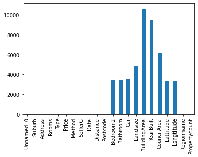
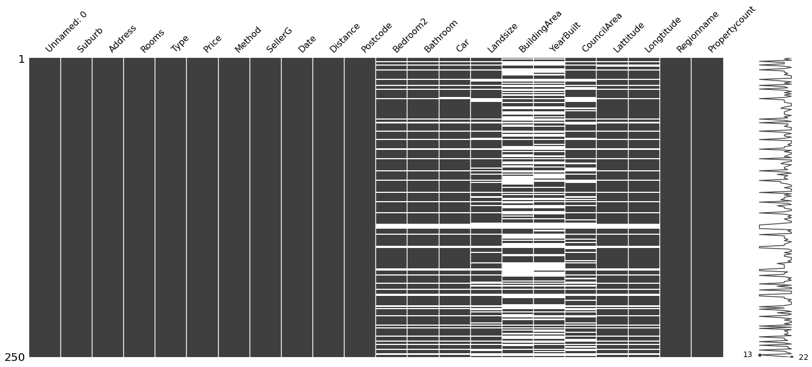
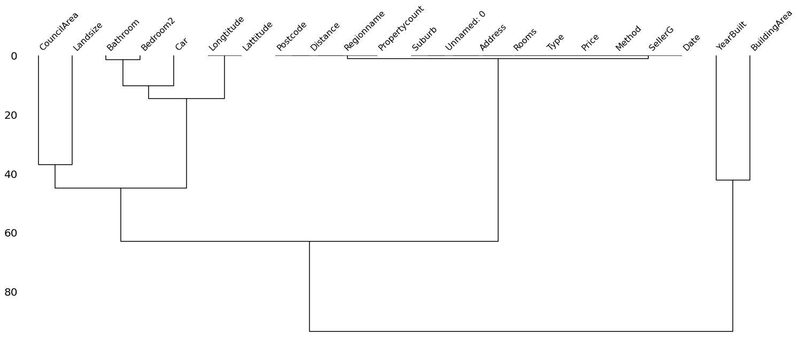
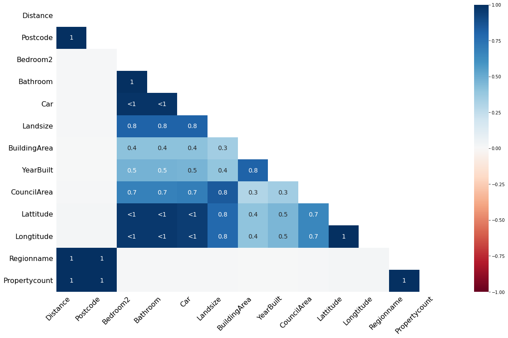

# Missing values

In this notebook:
- describe which variables have missing values in Pandas
- visualise missing data
- create variables to indicate missing values for specific variables (only for variables which have any missing values): i.e. var1_ismissing
- fill missing variables (using different approaches)

{: .no_toc } 
<details open markdown="block"> 
  <summary> 
    Table of contents 
  </summary> 
  {: .text-delta } 
1. TOC 
{:toc} 
</details> 


```python
# Setup
import numpy as np # linear algebra
import pandas as pd # data processing, CSV file I/O (e.g. pd.read_csv)
import missingno as msno
```


```python
# Load the data
df = pd.read_csv('https://github.com/esabunor/MLWorkspace/blob/master/melb_data.csv?raw=true')
#df = pd.read_csv('../input/melbourne-housing-snapshot/melb_data.csv') # when running on Kaggle
```

## Describe which variables have missing values
In Pandas, [isna()](https://pandas.pydata.org/docs/reference/api/pandas.isna.html) returns a dataframe/series of the same size, where an element is True if it is missing and False if it is not.

On working with missing values in Pandas, see the [Pandas tutorial](https://pandas.pydata.org/docs/user_guide/missing_data.html#values-considered-missing).


```python
# Count missing values
df.isna().sum()
```


    Unnamed: 0           0
    Suburb               0
    Address              0
    Rooms                0
    Type                 0
    Price                0
    Method               0
    SellerG              0
    Date                 0
    Distance             1
    Postcode             1
    Bedroom2          3469
    Bathroom          3471
    Car               3576
    Landsize          4793
    BuildingArea     10634
    YearBuilt         9438
    CouncilArea       6163
    Lattitude         3332
    Longtitude        3332
    Regionname           1
    Propertycount        1
    dtype: int64


```python
# Plot them
df.isna().sum().plot.bar() # the equivalent command in missingno is msno.bar(df)
```


    <AxesSubplot:>


    

    


```python
# Show which variables have missing values
df.isna().sum()>0
```


    Unnamed: 0       False
    Suburb           False
    Address          False
    Rooms            False
    Type             False
    Price            False
    Method           False
    SellerG          False
    Date             False
    Distance          True
    Postcode          True
    Bedroom2          True
    Bathroom          True
    Car               True
    Landsize          True
    BuildingArea      True
    YearBuilt         True
    CouncilArea       True
    Lattitude         True
    Longtitude        True
    Regionname        True
    Propertycount     True
    dtype: bool


```python
# Show the variables, which have missing values
has_miss = df.isna().sum()>0
has_miss.index[has_miss] # exactly equivalent to df.columns[has_miss]
```


    Index(['Distance', 'Postcode', 'Bedroom2', 'Bathroom', 'Car', 'Landsize',
           'BuildingArea', 'YearBuilt', 'CouncilArea', 'Lattitude', 'Longtitude',
           'Regionname', 'Propertycount'],
          dtype='object')


The first line is exactly the same as above. has_miss is a boolean array.

The trick here is in line 2 to only return the variables (which has_miss.index gives us) where the mask is True. 

The second line is also exactly identical to applying the mask has_miss to the column names from the original dataframe, see below


```python
# An equivalent approach: 
df.columns[has_miss]
```


    Index(['Distance', 'Postcode', 'Bedroom2', 'Bathroom', 'Car', 'Landsize',
           'BuildingArea', 'YearBuilt', 'CouncilArea', 'Lattitude', 'Longtitude',
           'Regionname', 'Propertycount'],
          dtype='object')


```python
# Describe some of the variables which have missing values
df[['BuildingArea', 'YearBuilt', 'Car', 'CouncilArea']].describe(include='all')
# df[list(df.columns[has_miss])].describe(include='all') # to describe all
```


<div>
<style scoped>
    .dataframe tbody tr th:only-of-type {
        vertical-align: middle;
    }

    .dataframe tbody tr th {
        vertical-align: top;
    }

    .dataframe thead th {
        text-align: right;
    }
</style>
<table border="1" class="dataframe">
  <thead>
    <tr style="text-align: right;">
      <th></th>
      <th>BuildingArea</th>
      <th>YearBuilt</th>
      <th>Car</th>
      <th>CouncilArea</th>
    </tr>
  </thead>
  <tbody>
    <tr>
      <th>count</th>
      <td>7762.000000</td>
      <td>8958.000000</td>
      <td>14820.000000</td>
      <td>12233</td>
    </tr>
    <tr>
      <th>unique</th>
      <td>NaN</td>
      <td>NaN</td>
      <td>NaN</td>
      <td>33</td>
    </tr>
    <tr>
      <th>top</th>
      <td>NaN</td>
      <td>NaN</td>
      <td>NaN</td>
      <td>Moreland</td>
    </tr>
    <tr>
      <th>freq</th>
      <td>NaN</td>
      <td>NaN</td>
      <td>NaN</td>
      <td>1163</td>
    </tr>
    <tr>
      <th>mean</th>
      <td>151.220219</td>
      <td>1965.879996</td>
      <td>1.615520</td>
      <td>NaN</td>
    </tr>
    <tr>
      <th>std</th>
      <td>519.188596</td>
      <td>37.013261</td>
      <td>0.955916</td>
      <td>NaN</td>
    </tr>
    <tr>
      <th>min</th>
      <td>0.000000</td>
      <td>1196.000000</td>
      <td>0.000000</td>
      <td>NaN</td>
    </tr>
    <tr>
      <th>25%</th>
      <td>93.000000</td>
      <td>1950.000000</td>
      <td>1.000000</td>
      <td>NaN</td>
    </tr>
    <tr>
      <th>50%</th>
      <td>126.000000</td>
      <td>1970.000000</td>
      <td>2.000000</td>
      <td>NaN</td>
    </tr>
    <tr>
      <th>75%</th>
      <td>174.000000</td>
      <td>2000.000000</td>
      <td>2.000000</td>
      <td>NaN</td>
    </tr>
    <tr>
      <th>max</th>
      <td>44515.000000</td>
      <td>2018.000000</td>
      <td>10.000000</td>
      <td>NaN</td>
    </tr>
  </tbody>
</table>
</div>


## Visualise missing variables

[missingo](https://github.com/ResidentMario/missingno) is a module to visualise data completeness and missing variables easily


```python
# Visualise the data as rows, this is great for seeing patterns
msno.matrix(df.sample(250))
```


    <AxesSubplot:>


    

    


```python
msno.dendrogram(df)
```


    <AxesSubplot:>


    

    


```python
msno.heatmap(df)
```


    <AxesSubplot:>


    

    


missingno can be [further configured](https://github.com/ResidentMario/missingno/blob/master/CONFIGURATION.md)


## Keep track of which values are missing/create dummies

Create variables that indicate - for a given observation - whether a value was missing.

In order to keep track of which missing values were 'imputed', run this code first. For each column which had missing values, this creates a new column indicating observations where the value was missing.


```python
# Create columns to indicate missing variables

for col in df.columns:
    # create the indicator variable only when a variable had any missing values in the first place
    if df[col].isnull().sum()>0:
        # create a variable equal 1 if the value is missing (for the given observation)
        df[str(col)+'_isna'] = df[col].isnull().astype(int)
```

## Fill missing values (using pandas.fillna() )


```python
# fill just one column
df['BuildingArea'].fillna(df['BuildingArea'].mean(), inplace=True) # mean
# fill with mode
df['CouncilArea'].fillna(df['CouncilArea'].mode(), inplace=True) # mode
```


```python
# fill multiple columns
usemedian = ['Car','YearBuilt']
for col in usemedian: # median
    df[col].fillna(df[col].median(), inplace=True)
```


```python
# fill all (remaining) columns
df.fillna(df.mean(), inplace=True)
```

    /opt/conda/lib/python3.7/site-packages/ipykernel_launcher.py:2: FutureWarning: Dropping of nuisance columns in DataFrame reductions (with 'numeric_only=None') is deprecated; in a future version this will raise TypeError.  Select only valid columns before calling the reduction.
      
    

#### Thinking more about imputation

Concepts:
- Conceptual frameworks: missing at random, missing conditionally at random, not missing at random
- single imputation, multiple imputation (Q: why multiple imputation? A: to account for uncertainty)
- univariate vs. multivariate imputation (univariate = when filling a missing value, only use this variable to value to decide a value to fill with; multivariate imputation = when filling a missing value, decide what the imputed value should by considering the observation as a whole, taking into account other feature dimension to decide on the missing value)

Book that I think we used at the IDinsight book club: https://stefvanbuuren.name/fimd/

#### Further things to learn

- Imputation/filling missing values in scikit-learn (potentially using the sklearn.impute.SimpleImputer)
- Imputation in statsmodels
